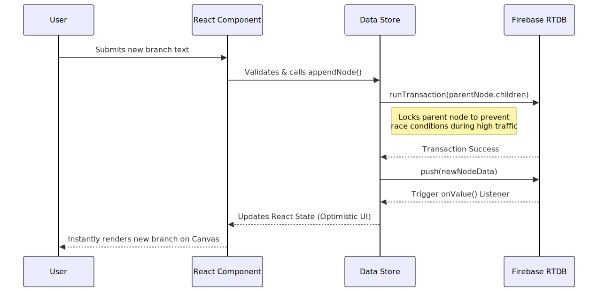

# Create_Your_Own_Story: Collaborative Branching Story Platform

[](https://reactjs.org/)
[](https://vitejs.dev/)
[](https://tailwindcss.com/)
[](https://firebase.google.com/)

Create_Your_Own_Story is a highly optimized, infinitely scalable collaborative storytelling platform. It enables communities to write branching narratives together in real-time, visualized through interactive node trees, complete with community voting to determine the "Canon Path."

## 📊 System Architecture & Data Flow

### High-Level Architecture



### Story Contribution Flow



## 🚀 Features & Implementation

- **Interactive Story Canvas:** Powered by `@xyflow/react`, this canvas translates relational NoSQL data into a visual node tree. It implements a recursive heatmap algorithm that traverses the tree to highlight the most popular branch (the "Canon Path").
- **3D Landing & Glassmorphism UI:** Built with `framer-motion` and Tailwind CSS v4, the UI provides a deeply immersive experience with interactive 3D transforms (`preserve-3d`, `rotateY`) and micro-animations.
- **Distraction-Free Workspace:** Features an auto-save drafting system using `localStorage` (`gw_draft_${nodeId}`) and native text-to-speech integration via `window.speechSynthesis`.
- **Contribution Heatmap:** A GitHub-style 60-day contribution grid tracking user writing activity and story age, gamifying the writing experience.

## 🏗️ Architecture & Scalability (Staff-Level Optimizations)

Create_Your_Own_Story is engineered to handle massive community interaction with an O(1) memory footprint and minimal bandwidth costs.

### 1. Data Layer & Concurrency
- **Denormalized NoSQL Schema:** Firebase Realtime Database is used with separate `stories` (metadata) and `nodes` (content) collections.
- **Transaction Safety:** Highly contested state (e.g., `likeCount`, appending child nodes) is updated via Firebase's `runTransaction()`, completely eliminating race conditions.

### 2. Performance Optimizations
- **Route-Based Code Splitting:** Heavy libraries like `@xyflow/react` are lazy-loaded via `<Suspense>`. This reduced the initial JS payload by over 60%, drastically improving Lighthouse and FCP metrics.
- **True Cursor-Based Pagination:** Replaced legacy offset fetching with cursor pagination (`limitToLast` & `endBefore`) attached to a native `IntersectionObserver`. This ensures O(1) client memory usage regardless of library size.
- **Component Memoization:** The `StoryNode` components are wrapped in `React.memo()`. In massive branching trees, panning the camera caching prevents thousands of nodes from re-rendering simultaneously, locking performance at 60FPS.
- **Optimistic UI:** Like buttons use state locks (`isLiking`) to update the UI instantly, masking network latency while preventing API rate limits from spam-clicking.
- **Backend Indexing:** Firebase `.indexOn: ["storyId", "authorId"]` is utilized to pre-sort data server-side, turning heavy O(N) client-side filtering into lightweight 50ms backend queries.

## 🛠️ Tech Stack

- **Frontend:** React 18, Vite
- **Styling:** Tailwind CSS v4, Framer Motion, Lucide-React
- **State Management / Data:** Abstracted Repository Pattern with Firebase Realtime Database
- **Visualization:** @xyflow/react

## 💻 Getting Started

### Prerequisites
- Node.js (v18+ recommended)
- A Firebase Project (with Realtime Database and Authentication enabled)

### Installation

1. **Clone the repository:**
   ```bash
   git clone https://github.com/your-username/create-your-own-story.git
   cd create-your-own-story
   ```

2. **Install dependencies:**
   ```bash
   npm install
   ```

3. **Environment Setup:**
   Create a `.env` file in the root directory and add your Firebase configuration:
   ```env
   VITE_FIREBASE_API_KEY="your_api_key"
   VITE_FIREBASE_AUTH_DOMAIN="your_auth_domain"
   VITE_FIREBASE_DATABASE_URL="your_database_url"
   VITE_FIREBASE_PROJECT_ID="your_project_id"
   VITE_FIREBASE_STORAGE_BUCKET="your_storage_bucket"
   VITE_FIREBASE_MESSAGING_SENDER_ID="your_sender_id"
   VITE_FIREBASE_APP_ID="your_app_id"
   VITE_FIREBASE_MEASUREMENT_ID="your_measurement_id"
   ```

4. **Run the Development Server:**
   ```bash
   npm run dev
   ```
   The application will be running on `http://localhost:5173`.

## 📜 Database Security Rules Example
To ensure the `.indexOn` optimizations work properly, apply these rules in your Firebase Console:

```json
{
  "rules": {
    ".read": "auth != null",
    ".write": "auth != null",
    "nodes": {
      ".indexOn": ["storyId", "authorId"]
    }
  }
}
```
